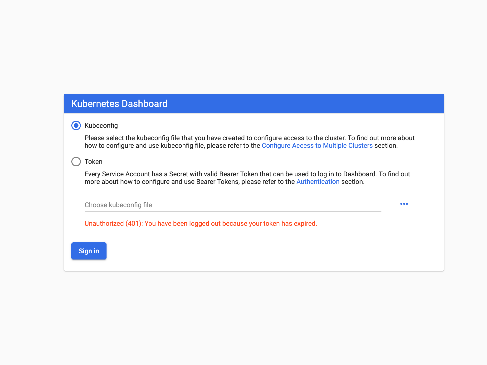

# EKS Cluster

This repo containing Terraform configuration files to provision an EKS cluster on AWS.

## Set up and initialize your Terraform workspace

```git clone https://github.com/marublaize/provision-eks-cluster && cd provision-eks-cluster```

In here, you will find six files used to provision a VPC, security groups and an EKS cluster. The final product should be similar to this:


1. **vpc.tf** provisions a VPC, subnets and availability zones using the AWS VPC Module. A new VPC is created for this tutorial so it doesn't impact your existing cloud environment and resources.

2. **security-groups.tf** provisions the security groups used by the EKS cluster.

3. **eks-cluster.tf** provisions all the resources (AutoScaling Groups, etc...) required to set up an EKS cluster using the AWS EKS Module.

4. **outputs.tf** defines the output configuration.

5. **versions.tf** sets the Terraform version to at least 0.14. It also sets versions for the providers used in this sample.

## Initialize Terraform workspace

```terraform init```

## Provisioning the cluster

This process should take approximately 10 minutes to be complete.

```bash
terraform plan
terraform apply -auto-approve
```

## Configure kubectl

```aws eks --region $(terraform output -raw region) update-kubeconfig --name $(terraform output -raw cluster_name)```

## Deploy Kubernetes Metric Server

```kubectl apply -f metrics-server-0.3.6/deploy/1.8+/```

Verify that the metrics server has been deployed. You should see something like this:

```kubectl get deployment metrics-server -n kube-system```

## Deploy Kubernetes Dashboard

```kubectl apply -f https://raw.githubusercontent.com/kubernetes/dashboard/v2.0.0-beta8/aio/deploy/recommended.yaml```

## Authenticate to the dashboard

To use the Kubernetes dashboard, you need to create a ClusterRoleBinding and provide an authorization token. This gives the cluster-admin permission to access the kubernetes-dashboard (authenticating using kubeconfig is not an option).

```kubectl apply -f kubernetes-dashboard-admin.rbac.yaml```

Then, generate the authorization token:

```kubectl -n kube-system describe secret $(kubectl -n kube-system get secret | grep service-controller-token | awk '{print $1}')```

Now create a proxy server that will allow you to navigate to the dashboard from the browser on your local machine. This will continue running until you stop the process:

```kubectl proxy```

You should be able to access and login to the Kubernetes [dashboard](http://127.0.0.1:8001/api/v1/namespaces/kubernetes-dashboard/services/https:kubernetes-dashboard:/proxy/).


